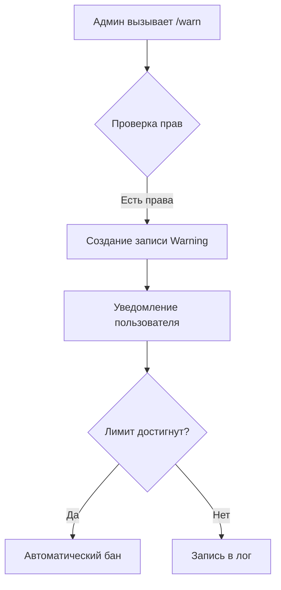
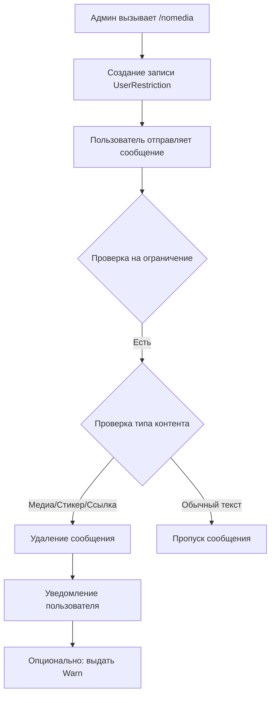

# 🤖 GroupGuardian — концепция Telegram-бота-модератора

## Часть 4: Ключевые функции и их логика

---

## 1. Система предупреждений (`/warn`)

### Принцип работы



### Хранение и срок действия

- Запись в таблице `Warning` с полем `expires_at`
- NULL = бессрочное предупреждение
- Глобальный срок действия настраивается через `WARN_EXPIRY_DAYS` (по умолчанию 30 дней)
- `is_active` вычисляется: `(expires_at IS NULL OR expires_at > NOW())`

### Автоматические наказания

- При достижении лимита (`warn_limit`) → автоматический бан
- Можно настроить замену бана на мут через переменную `WARN_ACTION` (ban/mute)

### Снятие предупреждения

- `/unwarn @user` — снимает одно активное предупреждение
- Можно снять все предупреждения через админ-панель


## 2. Ограничение `/nomedia` (уникальная фича)

### Принцип работы


### Что проверяется

| Тип контента | Проверка |
|--------------|----------|
| Медиа | `photo`, `video`, `animation`, `document`, `audio`, `voice`, `video_note` |
| Стикеры | `sticker` |
| Ссылки | `message.entities` (URL, TEXT_LINK) + регекс для URL в тексте |

### Время действия

- С указанием времени: `/nomedia @user 1h` → запись с `expires_at`
- Без времени: `/nomedia @user` → запись с `expires_at = NULL` (перманентно)
- Автоматическое снятие через TTL в Redis и фоновую задачу

## 3. Анти-спам и защита от флуда

### Обнаружение дублей

```python
# Псевдокод
if same_text_sent_by_user_in_last_N_seconds:
    delete_message()
    mute_user(duration="1h")
    add_warning(user, reason="Флуд")
```

### Анти-транслит

```python
# Преобразование "3aM3Ha" → "Замена"
translit_map = {
    '3': 'З', 'a': 'а', 'M': 'М', 'e': 'е', 'H': 'Н'
}
# Затем проверка на запрещённые слова
```

### Проверка ссылок

- Блокировка ссылок на каналы: `t.me/`, `telegram.me/`
- Блокировка подозрительных доменов (можно через API проверки возраста домена)

### 3.1. Капча при входе новых участников

#### Принцип работы

При вступлении нового пользователя в супергруппу бот выполняет следующие действия:

1. **Мгновенное ограничение прав** — бот вызывает `restrict_chat_member`, запрещая отправку текстовых сообщений, любых медиафайлов, стикеров, ссылок и добавление других участников. Право на просмотр чата и взаимодействие с инлайн-элементами (кнопками) сохраняется.

2. **Генерация задания** — из таблицы `captcha_tasks` случайно выбирается пара «Слово — Эмодзи» (например: «Котик» — 🐱).

3. **Отправка капчи** — бот отправляет сообщение: «Привет, @username! Нажми на кнопку: Котика» с инлайн-клавиатурой из 4 кнопок (1 правильная, 3 случайные ложные). Порядок кнопок всегда перемешивается.

4. **Защита от кликов** — если на кнопку капчи нажимает любой другой участник чата, бот игнорирует нажатие и выдаёт предупреждение (через alert-уведомление API Telegram): «Эта проверка не для вас!».

#### Сценарии исхода

| Сценарий | Действие бота |
|---|---|
| **Успех** | Клик по правильному эмодзи → снятие ограничений, автоматическое удаление сообщения с капчей, доступ к чату разрешён |
| **Ошибка (1-й раз)** | Клик по неверному эмодзи → исключение из группы с временным баном на 10 минут. В БД ставится отметка о 1-м нарушении |
| **Ошибка (2-й раз)** | При повторном входе (в любой другой день/время) → вечный бан в группе |
| **Таймаут** | Если за 60 секунд кнопка не нажата → мгновенный кик (удаление из чата без бана, с возможностью вернуться позже). Сообщение с капчей автоматически удаляется |

#### Хранение данных

- **`captcha_sessions`** — сессии проверки: `user_id`, `chat_id`, `task_id`, `message_id`, `attempts`, `is_passed`, `is_expired`, `started_at`, `expires_at`
- **`user_violations`** — нарушения для прогрессивного бана: `user_id`, `chat_id`, `violation_type` ('captcha_fail'), `created_at`, `expires_at`, `is_active`

#### Настройка

| Команда | Описание | Уровень доступа |
|---|---|---|
| `/setcaptcha on/off` | Включить/выключить капчу при входе новых участников | Супер-админ |
| `/setcaptchatimeout <секунды>` | Установить таймаут на прохождение капчи (по умолчанию 60) | Супер-админ |
| `/setcaptchaban <минуты>` | Установить длительность первого бана за ошибку (по умолчанию 10) | Супер-админ |

## 4. Защита от рейдов (`/antiraid`)

### Механизм работы

1. Мониторинг количества новых участников за временное окно
2. Порог: `ANTI_RAID_THRESHOLD` (по умолчанию 10 за `ANTI_RAID_WINDOW` минут)
3. При превышении → автоматическое включение режима «тишины»
4. Новые участники мучаются на `RAID_MUTE_DURATION` (по умолчанию 1 час)
5. Администраторы получают уведомление

### Настройка

```bash
/setantiraid on          # Включить защиту
/setantiraid off         # Отключить защиту
/setraidthreshold 15     # Установить порог 15 участников
/setraidwindow 3         # Установить окно 3 минуты

## 5. Пре-модерация сообщений (`/setmoderate on`)

### Как это работает

1. Все сообщения от обычных пользователей не публикуются
2. Сообщения отправляются модераторам (в приватный чат или ЛС)
3. Модератор видит инлайн-кнопки:
   - ✅ Одобрить → сообщение публикуется в чате
   - ❌ Отклонить → сообщение удаляется
   - ✏️ Редактировать → модератор может изменить текст
4. Все действия логируются

### Настройка

```bash
/setmoderate on          # Включить пре-модерацию
/setmoderate off         # Отключить пре-модерацию
/setmodchat @moderators  # Назначить чат для отправки сообщений на модерацию
```

## 6. Теневой бан (`/shadowban`)

### Принцип работы

1. Применение: `/shadowban @user 1d`
2. При каждом сообщении проверяется наличие активного теневого бана
3. Если есть → бот **немедленно удаляет сообщение** (пользователь видит его у себя, но другие нет)
4. Пользователь не получает уведомлений о наказании
5. Снятие: `/unshadowban @user` или по истечении времени

### Преимущества

- Без конфликтов — пользователь не знает, что наказан
- Эффективно против троллей — они теряют интерес, не видя реакции
- Время для администраторов собрать доказательства

## 7. Система ролей администраторов

### Уровни доступа

| Роль | Права |
|------|-------|
| `owner` | Все команды, включая `/setrole` |
| `admin` | Все команды, кроме `/setrole` |
| `moderator` | Только базовые команды |

### Назначение

```bash
/setrole @user moderator   # Назначить младшим модератором
/setrole @user admin       # Назначить старшим модератором
/setrole @user owner       # Назначить владельцем (только для owner)
```

### Проверка

```python
# Псевдокод
if user_role == "owner":
    разрешить все команды
elif user_role == "admin":
    разрешить все, кроме /setrole
elif user_role == "moderator":
    разрешить только базовые
else:
    отказать
```

## 8. Кастомные команды (`!ключ`)

### Создание

```bash
/addcmd !site Наш сайт: https://example.com
/addcmd !rules Правила чата: 1. Без спама 2. Без оскорблений
```

### Использование

```bash
Пользователь: !site
Бот: Наш сайт: https://example.com
```

### Удаление

```bash
/delcmd !site
```

## 9. Приветствия и прощания

### Установка

```bash
/setwelcome Добро пожаловать, {username}! Ознакомься с правилами: /rules
/setgoodbye {username} покинул чат. Будем скучать!
```

### Поддерживаемые переменные

| Переменная | Описание |
|------------|----------|
| `{username}` | Имя пользователя (@username) |
| `{first_name}` | Имя |
| `{last_name}` | Фамилия |
| `{chat_title}` | Название чата |

### Автоматическая отправка

- При событии `chat_member` (новый участник → приветствие)
- При событии `chat_member` (выход → прощание)

## 10. Голосования и опросы

### Создание

```bash
/poll "Какой язык программирования лучше?" Python Go JS Rust
```

### Закрытие

```bash
/closepoll 123    # По ID опроса
```

### Защита

- Каждый пользователь голосует один раз (стандартный механизм Telegram Poll)
- Администратор может закрыть опрос досрочно
- Результаты видны всем участникам

## 11. Статистика и отчёты

### Команда `/stats`

Показывает:
- Количество активных участников за день/неделю
- Количество выданных варнов, мутов, банов
- Топ-5 нарушителей
- Самые частые причины нарушений
- Количество удалённых сообщений за период

### Еженедельный отчёт

- Автоматически отправляется супер-админу в ЛС
- Содержит все метрики за неделю
- Настраивается через планировщик (APScheduler)

---

## 12. Автоматическая очистка старых сообщений

### Настройка

```bash
/setautoclean 30    # Удалять сообщения старше 30 дней
/setautoclean off   # Отключить автоочистку
```

### Механизм

1. Фоновая задача выполняется ежедневно в 03:00
2. Удаляет сообщения старше N дней
3. Исключения:
   - Закреплённые сообщения
   - Сообщения администраторов
   - Важные сообщения (с пометкой)

## 13. Интеграция с внешними анти-спам API

### Поддерживаемые API

| API | Назначение |
|-----|------------|
| CasinoBot API | Проверка пользователя в глобальном чёрном списке |
| Telegram SpamBot | Официальный анти-спам бот Telegram |

### Принцип работы

1. При вступлении нового пользователя бот проверяет его через API
2. Если пользователь в чёрном списке → автоматический бан
3. Результат проверки логируется

---

## 🔗 Ссылки

- Документация Telegram Bot API: [core.telegram.org/bots/api](https://core.telegram.org/bots/api)
- Документация aiogram: [docs.aiogram.dev](https://docs.aiogram.dev/)
- CasinoBot API: [casinobot.ru](https://casinobot.ru/)
